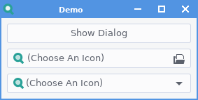
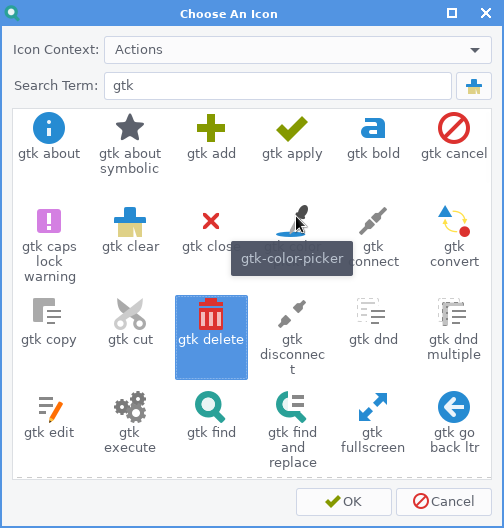
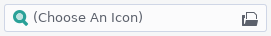
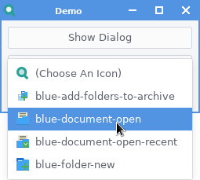
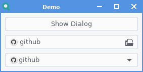

# About
GtkThemedIconChooser is a set of GTK+ 3 objects (2 widgets and 1 dialog) for
Python3, allowing selection of themed icons from the current icon theme.

- **IconChooserDialog:** GTK Dialog to display icons grouped by icon contexts
(Applications, Actions, Emoticions, etc.) with support for simple or regex
searching. Icon name is given as result of `run()`

- **IconChooserButton:** GTK Button to open an IconChooserDialog and display
the result like a GTK FileChooserButton. Icon name is given as result of a new
`icon-changed` signal.

- **IconChooserComboBox:** GTK Combo Box to display icons in a combo box. Icon
name is given as result of `changed` signal. Not recommended to be used without
heavy filtering of displayed icons due to likely UI freezing and how
impractical it is to find the icon you want from 1000s.



**Demo:** A demo, `demo.py` is also provided to demonstrate apperance and 
behaviour of the widgets.


# Usage
Currently there is not support for using GTK builder or the likes, I'm having a
hard time decyphering the documentation on how to do this in Python. For the
time being things have to be done the old way:
```
my_dialog = IconChooserDialog()
icon_name = my_dialog.run()
```

```
my_button = IconChooserButton()
my_button.connect('icon-selected', on_icon_selected)

def on_icon_selected(name):
    icon_name = name
```

```
my_combo = IconChooserComboBox()
my_button.connect('changed', on_icon_selected)

def on_icon_selected(combo):
    icon_name = combo.get_selected_icon_name()

```
**Common Methods:**

- `get/set_context_filter()`: Gets/sets a list of icon contexts for which icons
should be shown. Default is an empty list, meaning all contexts are used.
- `get/set_search_term()`: Gets/sets a string to use to search for items. (See
below for info on how searching is done.) Default is no term.
- `get/set_use_regex()`: Gets/sets whether to use regex for icon name
searching. Default is False (don't use regex)  
- `get_selected_icon_name()`: Gets the name of the currently selected icon.

**IconChooserDialog/Button Methods:**

- `get/set_icon_size()`: Gets/sets the pixel size to display icons in the
dialog, default is 32 px.

**IconChooserCombo Methods:**

- `populate()`: Used to populate the combo box. This is a costly operation
which must be done on the main thread, and will freeze your UI if 100s of icons
are being displayed, so this gives you control on when that happens (if it 
does).

**Icon Searching:**

If `use_regex` is set to `True`, the search term is used as a regex pattern for
matching icons. If it is set to `False`, the search term is compared against
icon names case-insensitive, with underscores and dashes replaced with spaces.

### Warning on Number of Icons Displayed
An icon theme can have 1000s of icons. In all 3 widgets provided icon previews
are displayed using widgets which must all be shown in the main thread, which
will cause delays in your UI. 

The IconChooserDialog manages this fairly well,
icon previews are loaded asynchronously and only 1 context at once is shown so
the UI will freeze for less than a second, and is often unnoticeable. 

The IconChooserComboBox really depends on what you're trying to do with it. 
Limit it to a couple of contexts and/or a good search term and you won't notice 
a thing, and at the same time your user stands a chance of finding the icon
they want. If however, you give no filters and the combobox tries to load
10,000 icons then expect long delays - this shouldn't be a problem though since 
if you want your user to look through more than maybe 20 icons, a combobox 
isn't what you should be using.
